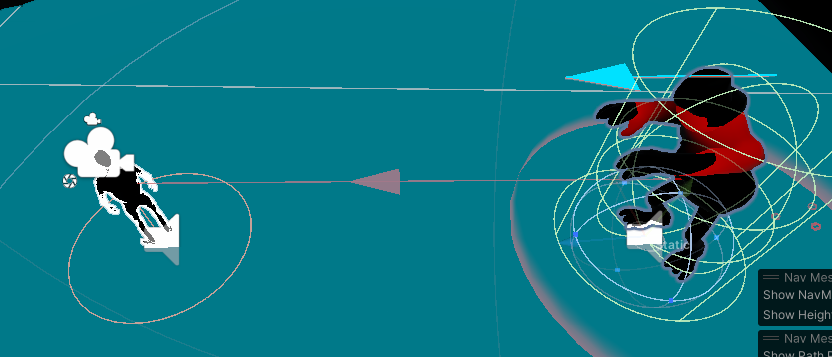
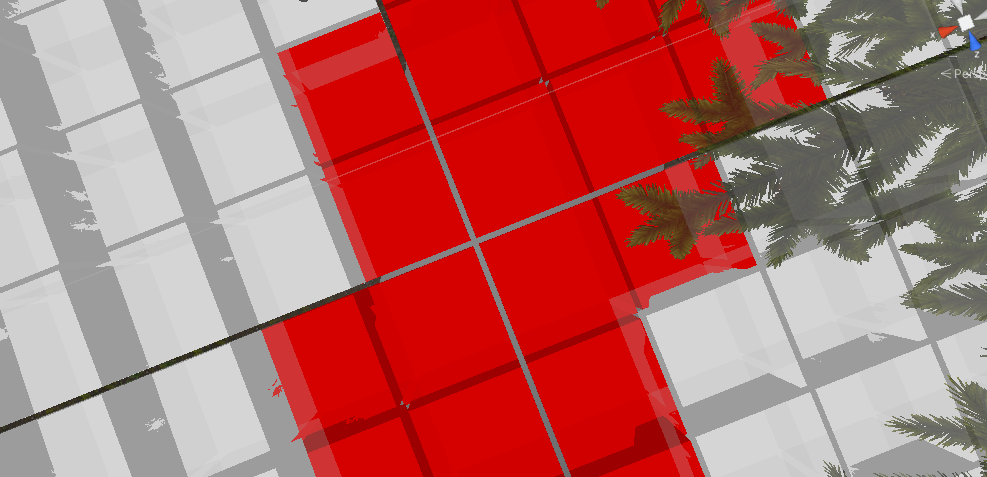
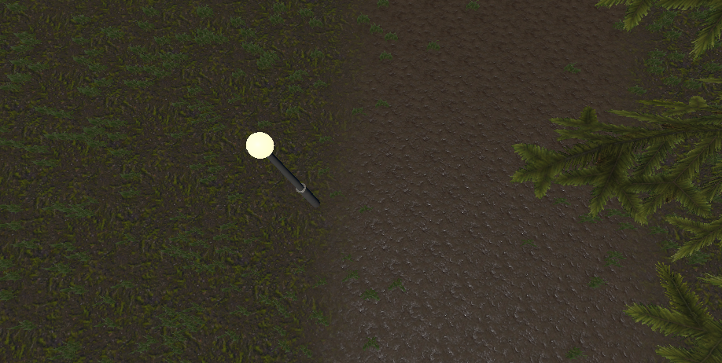

# Sound-Of-Dread

Welcome to Sound of Dread! This README.md file provides an overview of how the state machine, navmesh, and A* pathfinding are implemented in the game.

## State Machine

### Overview

In Sound of Dread, we use a state machine to manage the different states that enemies in the game can be in. The state machine helps organize and control the behavior of various game elements.

### Example Usage

```csharp
// Example code snippet demonstrating how to register a state of an entity
stateMachine.RegisterState(new AiStateChasePlayer());
stateMachine.RegisterState(new AiStatePatrol());
stateMachine.RegisterState(new AiStateAttack());
stateMachine.RegisterState(new AiStateIdle());
stateMachine.RegisterState(new AiStateChaseSound());
stateMachine.RegisterState(new AiStateDead());

// Example code snippet demonstrating how to change a state of an entity
stateMachine.ChangeState(initialState);
```


## Navmesh

### Overview

The game utilizes a navmesh system to enable intelligent navigation for enemies. Navmeshes are used to define walkable areas in the game world, allowing entities to navigate through the environment seamlessly.

### Example Usage

```csharp
navMeshAgent = GetComponent<NavMeshAgent>();
navMeshAgent.speed = agentSpeed;
navMeshAgent.stoppingDistance = agentStoppingDistance;
```

## A* Pathfinding

### Overview

A* pathfinding is a key component in Sound Of Dread for determining the optimal paths between points in the game world. It is used not only for guiding entities through the navmesh but also for the procedural generation of grass on the terrain.

### Example Usage

```csharp
// Example code snippet demonstrating how to use A* pathfinding so that the enemy uses it to go to the player location. In this case to follow him
agent.navMeshAgent.destination = agent.playerTranform.position;
```


## AI Procedural Generation of Grass

### Overview

A* pathfinding is employed in the AI-driven procedural generation of grass on the games terrain. The algorithm ensures that the grass is distributed in an aesthetically pleasing and realistic manner, enhancing the overall visual experience and at the same time with performance.

### Example Usage

```csharp
// Example code snippet illustrating how A* pathfinding is applied to generate grass on the terrain

// First of all to demonstrate what its been implemented we show the grid where the grass is being generated and where it will be spawned or not
for (int x = 0; x < gridSizeX; x++){
    for (int z = 0; z < gridSizeZ; z++){
        Vector3 worldPoint = terrainPosition + new Vector3(x * nodeRadius * 2 + nodeRadius, 0, z * nodeRadius * 2 + nodeRadius);

        float elevation = terrain.SampleHeight(worldPoint);

        worldPoint.y = elevation;

        bool walkable = IsPositionWalkable(worldPoint); 

        grid[x, z] = new Node(walkable, worldPoint, x, z);
    }
}
```


```csharp
// After that for each batch of grass we have we're drawing it in the GPU first so it will be faster otherwise spawning just prefabs will make the game run slower
public void GenerateVegetation(){
    foreach(var batch in batches){
        Graphics.DrawMeshInstanced(grassMesh, 0, grassMaterial, batch);
    }
}
```

