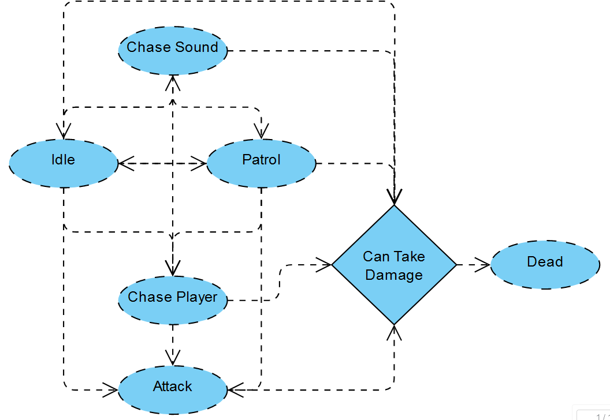

<center>

# Sound-Of-Dread

__Welcome to Sound of Dread! This README.md file provides an overview 
of how the state machine, navmesh, and A* pathfinding are implemented in the game.__

## State Machine

### Overview

__In Sound of Dread, we use a state machine to manage the different states that enemies in the game can be in.__
__The state machine helps organize and control the behavior of various game elements.__

### Example Usage

```csharp
// Example code snippet demonstrating how to register a state of an entity
stateMachine.RegisterState(new AiStateChasePlayer());
stateMachine.RegisterState(new AiStatePatrol());
stateMachine.RegisterState(new AiStateAttack());
stateMachine.RegisterState(new AiStateIdle());
stateMachine.RegisterState(new AiStateChaseSound());
stateMachine.RegisterState(new AiStateDead());

// Example code snippet demonstrating how to change a state of an entity
stateMachine.ChangeState(initialState);
```



## Navmesh

### Overview

__The game leverages a sophisticated navmesh system to facilitate intelligent navigation for enemies.__
__Navmeshes play a pivotal role in delineating walkable areas within the game world,__
__enabling entities to navigate through the environment seamlessly and with strategic precision__

### Example Usage

```csharp
// Example code snippet demonstrating how to get the agent (AI),
// set the speed and distance where he should stop
navMeshAgent = GetComponent<NavMeshAgent>();
navMeshAgent.speed = agentSpeed;
navMeshAgent.stoppingDistance = agentStoppingDistance;
```

## A* Pathfinding

### Overview

__A* pathfinding is a key component in Sound Of Dread for determining__
__the optimal paths between points in the game world.__ 
__It is used not only for guiding entities through the navmesh but also__
__for the procedural generation of grass on the terrain.__

### Example Usage

```csharp
// Example code snippet demonstrating how to use A* pathfinding 
// so that the enemy uses it to go to the player location. In this case to follow him
agent.navMeshAgent.destination = agent.playerTranform.position;
```


## AI Procedural Generation of Grass

### Overview

__A* pathfinding is employed in the AI-driven procedural generation of grass on the games terrain.__ 
__The algorithm ensures that the grass is distributed in an aesthetically pleasing and realistic manner,__
__enhancing the overall visual experience and at the same time with performance.__

### Example Usage

```csharp
// Example code snippet illustrating how A* pathfinding is applied to generate grass on the terrain

// First of all to demonstrate what its been implemented we show 
// the grid where the grass is being generated and where it will be spawned or not
private void CreateGrid(){
    if (terrain == null){
        return;
    }

    Vector3 terrainPosition = terrain.transform.position;
    Vector3 terrainSize = terrain.terrainData.size;

    int gridSizeX = Mathf.RoundToInt(terrainSize.x / (nodeRadius * 2));
    int gridSizeZ = Mathf.RoundToInt(terrainSize.z / (nodeRadius * 2));

    grid = new Node[gridSizeX, gridSizeZ];

    for (int x = 0; x < gridSizeX; x++){
        for (int z = 0; z < gridSizeZ; z++){
            Vector3 worldPoint = terrainPosition + new Vector3(x * nodeRadius * 2 + nodeRadius, 0, z * nodeRadius * 2 + nodeRadius);

            float elevation = terrain.SampleHeight(worldPoint);

            worldPoint.y = elevation;

            bool walkable = IsPositionWalkable(worldPoint); 

            grid[x, z] = new Node(walkable, worldPoint, x, z);
        }
    }
}
```

```csharp
// Example code snippet illustrating how A* pathfinding is applied to generate grass on the terrain
public void Update(){
    if (vegetationGenerator != null) vegetationGenerator.GenerateVegetation();
}
```


```csharp
// After that for each batch of grass we have we're drawing it
// in the GPU first so it will be faster otherwise spawning just prefabs will make the game run slower
public void GeneratePosition(Vector3[,] gridPositions){
    grassMesh = grassPrefab.GetComponent<MeshFilter>().sharedMesh;
    grassMaterial = grassPrefab.GetComponent<MeshRenderer>().sharedMaterial;
    
    if (grassPrefab.GetComponent<MeshFilter>() == null || grassPrefab.GetComponent<MeshRenderer>() == null){
        return;
    }

    int indexNum = 0;
    List<Matrix4x4> matrices = new List<Matrix4x4>();

    foreach (Vector3 position in gridPositions){
        for(int i = 0; i < numberOfGrassInstances; i++){
            Vector3 randomOffset = new Vector3(Random.Range(-1f, 1f), 0f, Random.Range(-1f, 1f));
            spawnPosition = position + randomOffset;

            AddObj(matrices, spawnPosition, i);
            indexNum++;

            if(indexNum >= 1000){
                batches.Add(matrices);
                matrices = BuildNewBatch();
                indexNum = 0;
            }
        }
    }
}

public void GenerateVegetation(){
    foreach(var batch in batches){
        RenderParams rp = new RenderParams(grassMaterial);
        Graphics.RenderMeshInstanced(rp, grassMesh, 0, batch);
    }
}
```


</center>